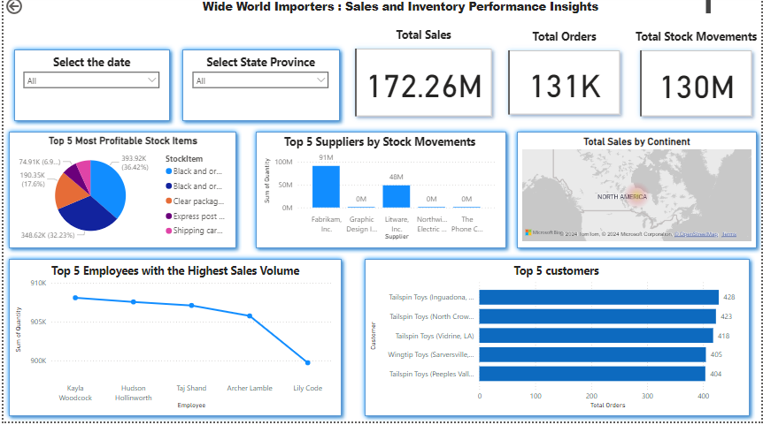

# **WWI-FabricDW**

## **Project Overview**
The primary objective of this project was to convert stored procedures in the **Wide World Importers** database into **Microsoft Fabric notebooks** in order to build a **data warehouse** and develop **Power BI dashboards** for answering analytical questions.

## **Key Steps**

### 1. **Control Table Creation**
A control table was created containing the following columns:
- **ID**: Unique identifier for each entry.
- **Table Name**: The name of the table in the Wide World Importers database.
- **Target Lakehouse Name**: The name of the target Lakehouse where the data is stored.
- **Query**: SQL queries for converting geographic datatype columns in the respective tables.

### 2. **Data Migration**
A **Fabric pipeline** was developed to migrate data from an on-prem **SQL Server** to the target **Lakehouse** using **Dataway**. The data was stored as **Parquet files** in the Lakehouse.

### 3. **Dynamic Delta Table Creation**
A **Dynamic Notebook** was created to convert the Parquet files into **Delta tables** dynamically, allowing for flexible schema management.

### 4. **Dimensional and Fact Tables**
A notebook called **CreationOfDimAndFactTables** was developed to:
- Create schemas.
- Store stored procedure code in views.
- Identify relationships between tables.
- Create corresponding **fact** and **dimension tables** for the data warehouse.

### 5. **Power BI Integration**
- The **dimensional and fact tables** were loaded into **Power BI Desktop** using **Import Mode**.
- Relationships between tables were established, and a **data model** was created.
- **Interactive reports** were developed, including a **summary page** with key visuals like:
  - **Customer Stats**
  - **Employee Stats**
  - **Stock Stats**
  - **Stock Turnover**
  - Visuals related to **Orders**
- The report leveraged **drill-up**, **drill-down**, and **drill-through** functionalities, allowing for deeper data exploration. Additionally, **slicers** were implemented for filtering the data and enabling users to focus on specific subsets of the data.

## **Built Data Warehouse - Summary Report**

